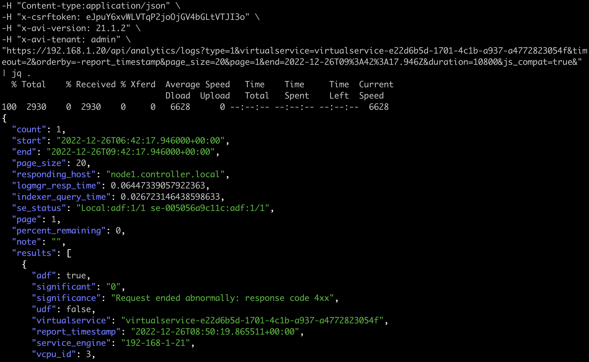
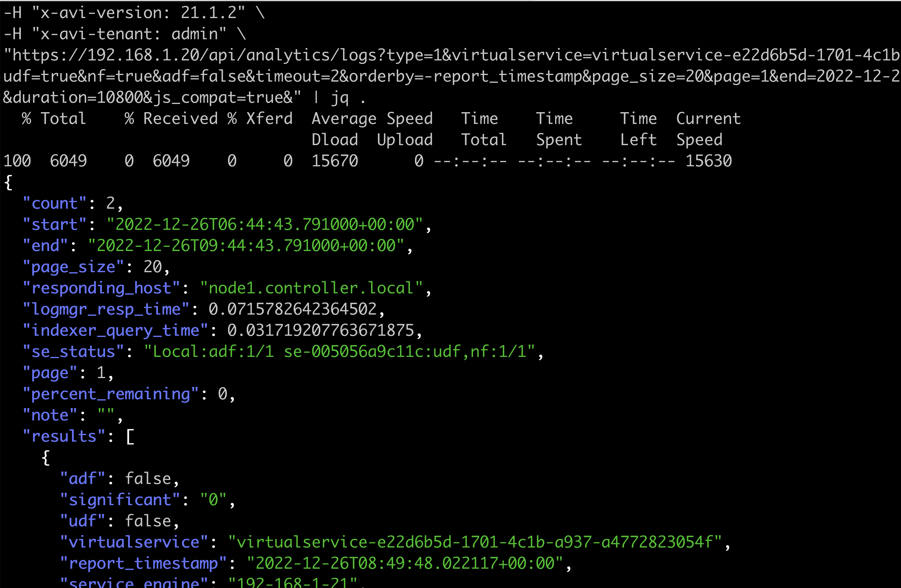

# 关于非重要和重要日志文档说明
## 配置需要在avi shell中配置允许基本用户名和密码
```shell
bash# shell
: > configure systemconfiguration
: systemconfiguration> portal_configuration
: systemconfiguration:portal_configuration> allow_basic_authentication
Overwriting the previously entered value for allow_basic_authentication
: systemconfiguration:portal_configuration> exit
: systemconfiguration> exit
```
## 测试命令
### 获取重要日志
其中需要替换用户名和密码，另外就是virtualservice的参数即vs的uuid，还有查询时间范围。
```shell
curl -k -X GET -u admin:c@123456 \
-H "Content-type:application/json" \
-H "x-csrftoken: eJpuY6xvWLVTqP2joOjGV4bGLtVTJI3o" \
-H "x-avi-version: 21.1.2" \
-H "x-avi-tenant: admin" \
"https://192.168.1.20/api/analytics/logs?type=1&virtualservice=virtualservice-e22d6b5d-1701-4c1b-a937-a4772823054f&timeout=2&orderby=-report_timestamp&page_size=20&page=1&end=2022-12-26T09%3A42%3A17.946Z&duration=10800&js_compat=true&"
```
效果截图

### 获取非重要日志
非重要日志唯一的区别是加入了参数“&udf=true&nf=true&adf=false”
```shell
curl -k -X GET -u admin:c@123456 \
-H "Content-type:application/json" \
-H "x-csrftoken: eJpuY6xvWLVTqP2joOjGV4bGLtVTJI3o" \
-H "x-avi-version: 21.1.2" \
-H "x-avi-tenant: admin" \
"https://192.168.1.20/api/analytics/logs?type=1&virtualservice=virtualservice-e22d6b5d-1701-4c1b-a937-a4772823054f&udf=true&nf=true&adf=false&timeout=2&orderby=-report_timestamp&page_size=20&page=1&end=2022-12-26T09%3A44%3A43.791Z&duration=10800&js_compat=true&"
```
效果截图

